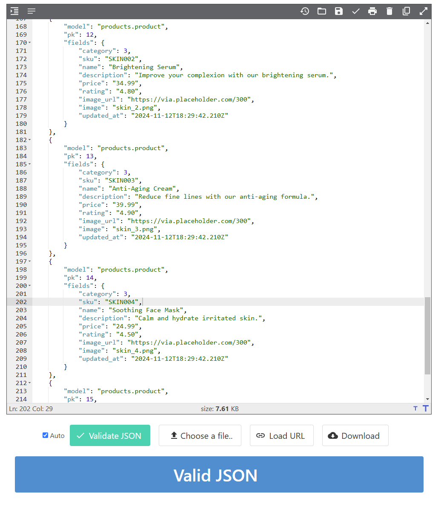

# Skönhetsbutiken - E-commerce Application


### Live Link:
[Skönhetsbutiken](https://pp5.onrender.com)

## Table of Contents
- [About the Project](#about-the-project)
- [Features](#features)
- [User Stories](#user-stories)
- [Technologies Used](#technologies-used)
- [Deployment](#deployment)
- [Testing](#testing)
- [SEO and Marketing Strategies](#seo-and-marketing-strategies)
- [Database Design](#database-design)
- [Wireframes](#wireframes)
- [Future Enhancements](#future-enhancements)
- [Acknowledgments](#acknowledgments)

---

## About the Project
Skönhetsbutiken is a full-stack e-commerce application designed for users to browse, purchase, and manage beauty products like lashes, glue, and other accessories. It provides an intuitive shopping experience with a modern design, secure authentication, and integrated payment processing.

This project was built as part of my portfolio for the [Diploma in Full Stack Software Development](https://www.codeinstitute.net/) to demonstrate my proficiency in building scalable web applications.


---

## Features
### Core Features
- **Product Browsing**: Users can browse different categories like lashes, glue, and special offers.
- **Responsive Design**: Fully mobile-optimized and responsive UI.
- **Shopping Cart**: Add, update, and remove products.
- **Checkout**: Integrated Stripe for secure payment processing.
- **User Authentication**: Registration, login, and profile management.
- **CRUD Operations**: Admins can manage products, offers, and user data.
- **SEO Optimized**: Includes meta tags, keywords, and OG tags for improved search engine visibility.

### Additional Features
- **Newsletter Signup**: Allows users to subscribe for updates and promotions.
- **Error Pages**: Custom 404 error page for better UX.
- **Social Media Integration**: Links to Instagram, TikTok, and other platforms.

## User Stories
### External Users

1. **Browsing Products**
   - As a user, I want to browse different product categories so that I can quickly find products relevant to my needs.
   - As a user, I want to view featured products on the homepage so that I can see recommended or popular items.

2. **Product Details**
   - As a user, I want to view detailed information about a product, including price, description, and images, so that I can decide whether to purchase it.

3. **Shopping Cart**
   - As a user, I want to add items to my shopping cart so that I can save them for checkout.
   - As a user, I want to view my shopping cart so that I can see the items I’ve selected and the total price.
   - As a user, I want to update item quantities in my cart so that I can adjust my purchase.
   - As a user, I want to remove items from my cart so that I can change my mind before checkout.

4. **Checkout**
   - As a user, I want to securely enter my payment details and complete my purchase so that I can buy products online.
   - As a user, I want to see a confirmation page after checkout so that I know my order has been successfully placed.

5. **User Account**
   - As a user, I want to register for an account so that I can save my personal details for future orders.
   - As a user, I want to log in to my account so that I can access my profile and order history.
   - As a user, I want to update my profile information so that my account remains up-to-date.

6. **Responsive Design**
   - As a user, I want to access the website on my mobile device so that I can shop conveniently while on the go.

7. **Contact Page**
   - As a user, I want to find the store's contact details so that I can get help or make inquiries.
   - As a user, I want to see a map of the store location so that I can find the physical store easily.

8. **SEO Optimization**
   - As a user, I want the website to have relevant keywords and descriptions so that it appears in search results when I look for beauty products.

9. **Newsletter**
   - As a user, I want to sign up for a newsletter so that I can receive updates and promotions from the store.


### Admin Users

1. **Product Management**
   - As an admin, I want to add new products to the catalog so that users can see the latest offerings.
   - As an admin, I want to edit product information so that I can correct any mistakes or update details.
   - As an admin, I want to delete discontinued products so that the catalog stays current.

2. **Order Management**
   - As an admin, I want to view all user orders so that I can track and fulfill them.

3. **User Management**
   - As an admin, I want to access user profiles so that I can help users with account-related issues.

---

## Technologies Used
### Frontend
- HTML5
- CSS3
- Bootstrap 5
- JavaScript

### Backend
- Python 3
- Django 4
- PostgreSQL

### Tools
- Stripe (Payment integration)
- Render (Deployment)
- GitPod & GitHub (Version control)
- Balsamiq (Wireframe design)

---

## Deployment

This application has been deployed using [Render](https://render.com/). Below are the steps to deploy the project:

---

### Step 1: Create a Render Account
- Visit [Render](https://render.com/) and sign up for an account if you don't already have one.

---

### Step 2: Create a New Web Service
1. Go to the **Dashboard** in Render.
2. Click on **New** and select **Web Service**.
3. Connect your GitHub repository to Render and select the repository for your project.

---

### Step 3: Configure the Web Service
- Set the following options:
  - **Name**: Give your app a name (e.g., `your-app-name`).
  - **Region**: Choose a deployment region.
  - **Branch**: Select the branch you want to deploy (e.g., `main`).
  - **Build Command**: 
    ```
    pip install -r requirements.txt
    ```
  - **Start Command**: 
    ```
    gunicorn your_project_name.wsgi
    ```

---

### Step 4: Set Environment Variables
- In the **Environment** section, add the following variables: SECRET_KEY=<your-secret-key> DEBUG=False ALLOWED_HOSTS=your-app-name.herokuapp.com STRIPE_PUBLIC_KEY=<your-stripe-public-key> STRIPE_SECRET_KEY=<your-stripe-secret-key>

---

### Step 5: Prepare Your Local Environment
- Install dependencies: pip install dj-database-url psycopg2-binary gunicorn
- Update your `requirements.txt`: pip freeze > requirements.txt

---

### Step 6: Create a Procfile
- In your project root, create a `Procfile` with the following content: web: gunicorn your_project_name.wsgi

---

### Step 7: Add a Database Resource
- In Render, navigate to your **Dashboard** and select your service.
- Under the **Resources** tab, add a **Postgres Database**.
- Note the `DATABASE_URL` generated for the database.
- Add the `DATABASE_URL` to your **Environment Variables** in the Render **Settings**.

---

### Step 8: Run Database Migrations
- Open the **Shell** in Render or use your local terminal.
- Run the following commands:
  ```bash
  python manage.py makemigrations
  python manage.py migrate

---

### Step 9: Configure Static Files
- Ensure your Django project is set up to handle static files correctly:
  - Add the following to your `settings.py`:
    ```python
    STATIC_URL = '/static/'
    STATIC_ROOT = os.path.join(BASE_DIR, 'staticfiles')
    ```
  - Run the following command locally to collect static files:
    ```bash
    python manage.py collectstatic
    ```
- Push the changes to your repository.

---

### Step 10: Enable Automatic Deployments
- In Render, navigate to your service's **Settings**.
- Under the **Deploy** section, link your app to your GitHub repository.
- Enable **Automatic Deploys** so that any push to the selected branch triggers a deployment.

---

### Step 11: Add a Custom Domain (Optional)
- To use a custom domain:
  1. In Render, go to your service's **Settings**.
  2. Add your custom domain (e.g., `www.example.com`).
  3. Update the `ALLOWED_HOSTS` in your `settings.py`:
     ```python
     ALLOWED_HOSTS = ['your-app-name.onrender.com', 'your-custom-domain.com']
     ```
  4. Configure your domain registrar to point to Render by adding the necessary DNS records.

---

### Step 12: Test the Application
- Access your app at the default Render URL or your custom domain (if configured).
- Check all functionality, including:
  - User authentication
  - Payment processing (if applicable)
  - Database CRUD operations
  - Responsiveness on different devices
- Troubleshoot any issues by checking the **Logs** in the Render dashboard.

---

## Testing

## HTML Validation
W3C was used for validating html code
<details><summary>Home</summary></details><hr>
<details><summary>Glue</summary></details><hr>
<details><summary>Lashes</summary></details><hr>
<details><summary>Other</summary></details><hr>
<details><summary>Products</summary></details><hr>
<details><summary></summary></details><hr>
<details><summary></summary></details><hr>


## JavaScript Validation
JSHint JS Validation Service

<details><summary>Products.json</summary></details><hr>
<details><summary>Staticfiles.json</summary></details><hr>


### CSS Validation
The W3C Jigsaw CSS Validation Service

<details><summary>Base.css</summary>
  <a href="read_img/base.css.png" target="_blank"></a>
</details><hr>


### PEP8 Validation
Service was used to check the Python code

<details><summary>Running pycodestyle .</summary>
  </details><hr>
<details><summary>Running autopep8 --in-place --aggressive --aggressive **/*.py</summary></details><hr>
<details><summary>Manual fix</summary></details><hr>

## SEO and Marketing Strategies


---

## Database Design


---

## Wireframes
The wireframes were created using Balsamiq

<details><summary>Balsamiq</summary></details><hr>

---

## Future Enhancements

---

## Acknowledgments

---


